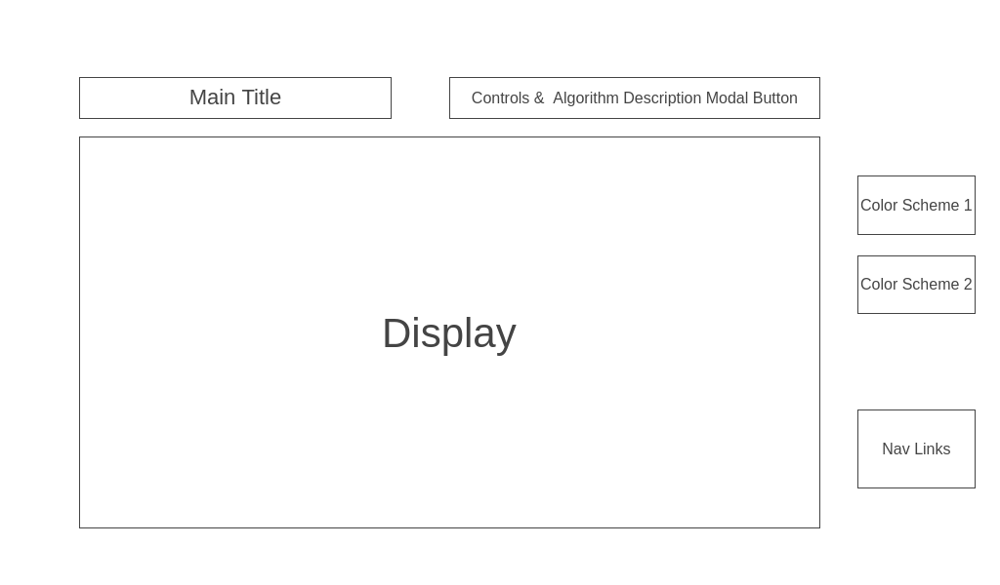

<h1>Background</h1>

"Sort Visualizer" is an inuitive learning tool designed to help users better understand how different sorting algorithms work.

The data is displayed as a bar chart that, when activated, will shift its bars in the pattern of the chosen algorithm. Throughout this process, the color of each bar will change depending its status (sorted, unsorted, currently being sorted).

"Sort Visualizer" also contains a modal with details about the currently selected algorithm, showing information about how the algorithm sorts data, as well as its advantages/disadvantages and its time/space complexity.

 

<h1>Functionality & MVPs</h1>

In "Sort Visualizer," users are be able to:
<ul>
    <li>Start and reset the visualization</li>
    <li>Select an algorithm</li>
    <li>Choose a number of inputs to sort</li>
    <li>Toggle a modal to learn more about each algorithm</li>
</ul>
In addition, this project will include:
<ul>
    <li>A modal describing "Sort Visualizer" and instructions on how to use it</li>
    <li>A production README</li>
</ul>

 

<h1>Wireframes</h1>

 
<ul>
    <li>
    Nav Links:
        <ul>
            <li>Application GitHub Repository</li>
            <li>LinkedIn</li>
            <li>Application Description/Instructions Modal</li>
        </ul>
    </li>
    <li>Controls will include start and stop buttons</li>
    <li>The Algorithm Description Modal Button will display information about the current sorting algorithm</li>
    <li>Color scheme buttons toggle light/dark mode</li>
</ul>

 

<h1>Technologies, Libraries, APIs</h1>
<h3>This application implements:</h3> 
<ul>
    <li>The D3 library to visualize data</li>
    <li>Webpack to bundle Javascript code</li>
</ul>

 

<h1>Implementation Timeline</h1>
Friday Afternoon & Weekend: Research D3, set up project, and get chart to render on the screen

Monday: Create bubble sort logic as well as responsive chart

Tuesday: Implement modals and start/stop buttons

Wednesday: Complete styling and begin bonus

Thursday morning: Deploy on GitHub Pages

 

<h1>Bonus Features</h1>
<ul>
    <li>Create visualizations for additional sorting algorithms (ex. merge sort, quick sort, insertion sort, selection sort)</li>
    <li>Mobile responsive</li>
</ul>

