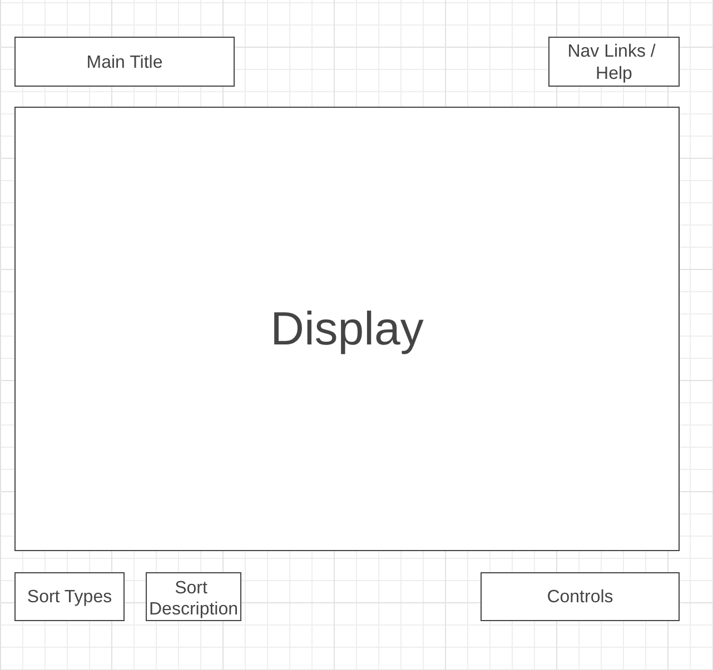

<h1>Background</h1>

"Sort Visualizer" is an inuitive learning tool designed to help users gain a better understanding of how different sorting algorithms work. 

The dataset of randomly sized elements is displayed as a bar chart that, when activated, will sort itself in the pattern of the chosen algorithm. Throughout this process, the color of each bar will change depending its sorted status.

"Sort Visualizer" also contains a modal with details about the currently selected algorithm, showing information about how it sorts data, as well as the algorithm's common uses and its time/space complexity.

 

<h1>Functionality & MVPs</h1>

In "Sort Visualizer," users are be able to:
<ul>
    <li>Start and reset the visualization</li>
    <li>Select an algorithm</li>
    <li>Choose a number of inputs to sort</li>
    <li>Select a sort speed</li>
    <li>Toggle a modal to learn more about each algorithm</li>
</ul>
In addition, this project includes:
<ul>
    <li>A modal describing the "Sort Visualizer" application and instructions on how to use it</li>
    <li>A production README</li>
</ul>

 

<h1>Wireframes</h1>

 
<ul>
    <li>
    Nav Links:
        <ul>
            <li>Application GitHub Repository</li>
            <li>LinkedIn</li>
            <li>Application Description/Instructions Modal</li>
        </ul>
    </li>
    <li>Controls will include:
        <ul>
            <li>Sort Selector</li>
            <li>Speed Selector</li>
            <li>Input Size Selector</li>
            <li>Start Button</li>
            <li>Reset Button</li>
        </ul>
    </li>
    <li>The Algorithm Description Modal Button will display information about the current sorting algorithm</li>
</ul>

 

<h1>Technologies, Libraries, APIs</h1>
<h3>This application implements:</h3> 
<ul>
    <li>Javascript, HTML, CSS</li>
    <li>The D3 library to visualize data</li>
    <li>Webpack to bundle Javascript code</li>
</ul>

 

<h1>Implementation Timeline</h1>
<ul>
    <li>
        Friday Afternoon & Weekend: Research D3, set up project, and get chart to render on the screen
    </li>
    <li>
        Monday: Create bubble sort logic as well as responsive chart
    </li>
    <li>
        Tuesday: Implement modals and start/stop buttons
    </li>
    <li>
        Wednesday: Begin bonus (add another alogorithm)
    </li>
    <li>
        Thursday morning: finish up and deploy project
    </li>
</ul>

 

<h1>Bonus Features</h1>
<ul>
    <li>Create visualizations for additional sorting algorithms (ex. merge sort, quick sort, insertion sort, selection sort)</li>
    <li>Scale to select speed</li>
</ul>

